# Personal Dashboard Architecture

> **Document status:** Active technical reference  
> **Project:** Personal Dashboard  
> **Repository:** `rohamcarrion-cloud/personal-dashboard`  
> **Architecture maturity:** Local-development baseline  
> **Last reviewed:** July 2026

---

## Table of Contents

- [1. Purpose](#1-purpose)
- [2. Scope](#2-scope)
- [3. Architectural Goals](#3-architectural-goals)
- [4. Current System Overview](#4-current-system-overview)
- [5. High-Level Architecture](#5-high-level-architecture)
- [6. Repository Architecture](#6-repository-architecture)
- [7. Component Responsibilities](#7-component-responsibilities)
- [8. Frontend Architecture](#8-frontend-architecture)
- [9. API Architecture](#9-api-architecture)
- [10. PocketBase Architecture](#10-pocketbase-architecture)
- [11. Authentication and Authorization](#11-authentication-and-authorization)
- [12. Request Lifecycle](#12-request-lifecycle)
- [13. Data Flow](#13-data-flow)
- [14. Content and Publishing Architecture](#14-content-and-publishing-architecture)
- [15. AI Integration Architecture](#15-ai-integration-architecture)
- [16. External Platform Integrations](#16-external-platform-integrations)
- [17. Configuration Management](#17-configuration-management)
- [18. Security Boundaries](#18-security-boundaries)
- [19. Error Handling and Operational Visibility](#19-error-handling-and-operational-visibility)
- [20. Local Development Architecture](#20-local-development-architecture)
- [21. Deployment Architecture](#21-deployment-architecture)
- [22. Scalability Considerations](#22-scalability-considerations)
- [23. Architectural Decisions](#23-architectural-decisions)
- [24. Known Limitations](#24-known-limitations)
- [25. Future Evolution](#25-future-evolution)
- [26. Change Management](#26-change-management)
- [27. Related Documentation](#27-related-documentation)

---

## 1. Purpose

This document describes the technical architecture of Personal Dashboard.

Its purpose is to explain:

- How the repository is organized
- Which major applications exist
- What each application is responsible for
- How requests and data move through the system
- Where authentication, persistence, integrations, and business logic belong
- Which architecture is implemented today
- Which capabilities are planned but not yet production-ready
- Which design decisions guide future development

This is a living document. It should be updated whenever a material architectural change is introduced.

The README serves as the repository’s public front door. This document serves as the technical reference for contributors, reviewers, future maintainers, and engineers evaluating the project.

---

## 2. Scope

This document covers the current monorepo architecture built around:

- React
- Vite
- Node.js
- Express
- PocketBase
- SQLite
- npm workspaces

It also covers the intended architectural boundaries for:

- Public website routes
- Protected dashboard routes
- Content workflows
- Publishing workflows
- AI-assisted workflows
- OAuth integrations
- Social platform integrations
- Local development
- Future deployment

This document does not attempt to define every database collection, route, component, or API contract. Those details should live closer to the code or in dedicated reference documentation.

---

## 3. Architectural Goals

Personal Dashboard is being developed around the following architectural goals.

### 3.1 Ownership

The application should be operable from source code and infrastructure controlled by the project owner.

This includes ownership of:

- Source code
- Data
- Configuration
- Deployment
- Backups
- Integrations
- Operational workflows

### 3.2 Modularity

The system should separate major concerns so that frontend, API, persistence, integrations, and infrastructure can evolve without becoming one tightly coupled codebase.

### 3.3 Reproducibility

A future developer should be able to clone the repository, install dependencies, configure the environment, and run the system using documented steps.

### 3.4 Secure Defaults

Secrets, credentials, runtime databases, backups, and platform-specific binaries should not be committed to Git.

### 3.5 Honest Documentation

Implemented capabilities and planned capabilities must be clearly distinguished.

The repository must not imply that a workflow is production-ready merely because interfaces, schemas, or integration code exist.

### 3.6 Incremental Evolution

The system should grow through small, reviewable architectural changes rather than large undocumented rewrites.

### 3.7 Portfolio Quality

The repository should demonstrate professional engineering habits without overstating maturity, scale, reliability, or production readiness.

---

## 4. Current System Overview

Personal Dashboard is a monorepo containing three primary workspaces:

1. `apps/web`
2. `apps/api`
3. `apps/pocketbase`

The current architecture uses:

- A React and Vite web application
- A Node.js and Express API
- PocketBase for authentication, collections, SQLite persistence, migrations, hooks, and file storage
- npm workspaces for dependency and script coordination

The web application may communicate directly with PocketBase for supported data and authentication operations. It may also communicate with the Express API for server-side workflows, integration logic, protected operations, and orchestration.

The Express API may communicate with PocketBase and with external services.

The architecture is currently optimized for local development and controlled evolution toward a self-hosted deployment.

---

## 5. High-Level Architecture

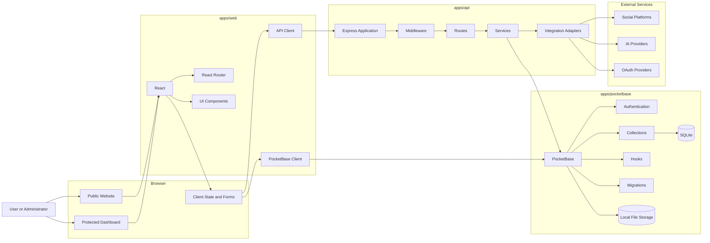

### 5.1 Architectural Interpretation

The diagram represents architectural responsibilities, not a guarantee that every path is fully implemented for every feature.

The core separation is:

- The browser owns presentation and interaction
- The React application owns client-side experience
- The Express API owns server-side orchestration
- PocketBase owns authentication and persistence
- Integration adapters own external service communication

---

## 6. Repository Architecture

```text
personal-dashboard/
├── apps/
│   ├── api/
│   │   ├── migrations/
│   │   ├── src/
│   │   │   ├── constants/
│   │   │   ├── middleware/
│   │   │   ├── routes/
│   │   │   ├── services/
│   │   │   └── utils/
│   │   ├── .env.example
│   │   └── package.json
│   │
│   ├── pocketbase/
│   │   ├── pb_hooks/
│   │   ├── pb_migrations/
│   │   ├── database-types.d.ts
│   │   ├── .pocketbase-version
│   │   └── package.json
│   │
│   └── web/
│       ├── plugins/
│       ├── public/
│       ├── src/
│       │   ├── components/
│       │   ├── contexts/
│       │   ├── docs/
│       │   ├── hooks/
│       │   ├── lib/
│       │   ├── pages/
│       │   └── utils/
│       ├── tools/
│       ├── vite.config.js
│       └── package.json
│
├── docs/
├── package.json
├── package-lock.json
└── README.md
```

### 6.1 Monorepo Rationale

The monorepo keeps related applications in one version-controlled repository.

Benefits include:

- One project history
- Coordinated changes across frontend, API, and persistence
- Shared root commands
- Easier local development
- Easier architecture documentation
- Easier validation of cross-workspace changes

Tradeoffs include:

- Larger repository scope
- Increased need for workspace boundaries
- Potential coupling through shared assumptions
- More complex deployment if workspaces are later separated

---

## 7. Component Responsibilities

| Component | Primary responsibility | Should not become responsible for |
| --- | --- | --- |
| `apps/web` | Presentation, navigation, forms, local interaction, browser-side state | Secret handling, privileged service credentials, direct provider administration |
| `apps/api` | Server-side workflows, integrations, orchestration, validation, protected operations | Rendering the user interface, storing browser-only state |
| `apps/pocketbase` | Authentication, persistence, collections, migrations, hooks, local files | Complex external integration orchestration |
| External providers | Platform-specific services | Internal application authority or canonical business state |

### 7.1 Boundary Principle

A component should own logic that matches its trust boundary.

Examples:

- Browser-visible UI logic belongs in `apps/web`
- OAuth client secrets belong in server-side configuration
- Database schema evolution belongs in PocketBase migrations
- Multi-step publishing workflows belong in API services
- Public content retrieval may be browser-to-PocketBase when rules permit
- Privileged or provider-authenticated operations should pass through the API

---

## 8. Frontend Architecture

The frontend is implemented in `apps/web`.

### 8.1 Responsibilities

The frontend is responsible for:

- Public website presentation
- Protected dashboard presentation
- Route navigation
- Forms
- Validation feedback
- Content management interfaces
- Project and workflow interfaces
- Analytics visualization
- User-triggered actions
- Client-side application state
- Communicating with PocketBase
- Communicating with the Express API

### 8.2 Current Frontend Stack

The current frontend dependency set includes:

- React 18
- React DOM
- React Router
- Vite
- React Hook Form
- Zod
- Radix UI components
- Tailwind CSS
- Recharts
- Framer Motion
- Lucide React
- Sonner
- PocketBase JavaScript SDK

### 8.3 Frontend Structure

The existing source structure indicates separation by concern:

```text
apps/web/src/
├── components/
├── contexts/
├── docs/
├── hooks/
├── lib/
├── pages/
└── utils/
```

Recommended responsibilities:

| Directory | Responsibility |
| --- | --- |
| `components/` | Reusable visual and behavioral components |
| `contexts/` | Shared React context providers |
| `hooks/` | Reusable stateful browser logic |
| `lib/` | Client configuration, SDK setup, helpers |
| `pages/` | Route-level screens |
| `utils/` | Pure utility functions |
| `docs/` | In-application documentation or content definitions |

### 8.4 Route Boundary

The frontend should maintain a clear distinction between:

- Public routes
- Authenticated routes
- Administrative routes
- Future role-restricted routes

A route being hidden in the interface is not authorization.

Authorization must ultimately be enforced by PocketBase collection rules or by server-side API logic.

### 8.5 Frontend State

The project should prefer the smallest appropriate state scope:

1. Component-local state
2. Reusable custom hooks
3. Context for cross-tree concerns
4. Persistent backend state in PocketBase

Large global state should not be introduced unless the application demonstrates a real need for it.

---

## 9. API Architecture

The API is implemented in `apps/api`.

### 9.1 Responsibilities

The API is responsible for:

- Server-side request handling
- Cross-service orchestration
- External API communication
- OAuth support
- Publishing operations
- Analytics support
- Protected business logic
- Input validation
- Error normalization
- Security middleware
- Rate limiting
- Logging

### 9.2 Current API Stack

The current API dependency set includes:

- Node.js
- Express 5
- Axios
- CORS
- dotenv
- Helmet
- Morgan
- Express Rate Limit
- PocketBase JavaScript SDK

### 9.3 Layering

The source structure supports a layered design:

```text
apps/api/src/
├── constants/
├── middleware/
├── routes/
├── services/
└── utils/
```

The intended dependency direction is:

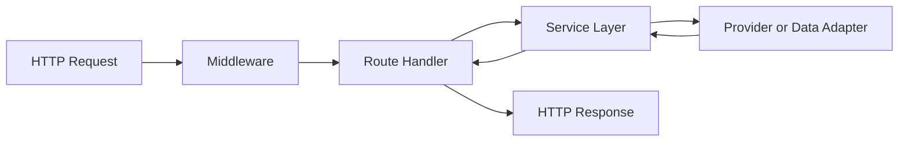

### 9.4 Route Responsibilities

Route handlers should:

- Parse the request
- Validate inputs
- Determine the appropriate service call
- Convert service results into HTTP responses
- Avoid embedding complex provider logic

### 9.5 Service Responsibilities

Services should:

- Implement application workflows
- Coordinate PocketBase and external providers
- Normalize provider-specific behavior
- Return predictable results
- Throw or return structured errors

### 9.6 Middleware Responsibilities

Middleware may handle:

- CORS
- Security headers
- Logging
- Rate limiting
- Authentication verification
- Request identifiers
- Error handling

---

## 10. PocketBase Architecture

PocketBase is implemented in `apps/pocketbase`.

### 10.1 Responsibilities

PocketBase provides:

- Authentication
- Collection-based persistence
- SQLite storage
- File storage
- Collection access rules
- Migration execution
- JavaScript hooks
- Administrative interfaces during development

### 10.2 Versioning

The repository pins PocketBase through:

```text
apps/pocketbase/.pocketbase-version
```

The current known version is:

```text
0.38.0
```

The executable itself should remain untracked because it is platform-specific.

### 10.3 Schema Management

Database schema should be treated as code.

Versioned migrations belong in:

```text
apps/pocketbase/pb_migrations/
```

Migrations should be committed because they provide:

- Reproducibility
- Reviewability
- Schema history
- Controlled environment setup

Runtime database state should not be committed.

### 10.4 Hooks

PocketBase hooks belong in:

```text
apps/pocketbase/pb_hooks/
```

Hooks should remain focused and documented.

Complex external workflows should generally remain in the Express API rather than expanding hooks into an undocumented secondary application server.

### 10.5 Data Ownership

PocketBase is the current system of record for application data.

External providers should not become the only authoritative source for internal workflow state.

For example, a social platform may confirm that a post was published, but Personal Dashboard should retain its own record of:

- The content
- Intended platform
- Scheduled state
- Publishing attempt
- Provider response
- Final status
- Relevant timestamps

---

## 11. Authentication and Authorization

### 11.1 Authentication Authority

PocketBase is the current authentication authority.

The browser authenticates with PocketBase and receives authentication state appropriate to the PocketBase SDK and collection model.

### 11.2 High-Level Authentication Flow

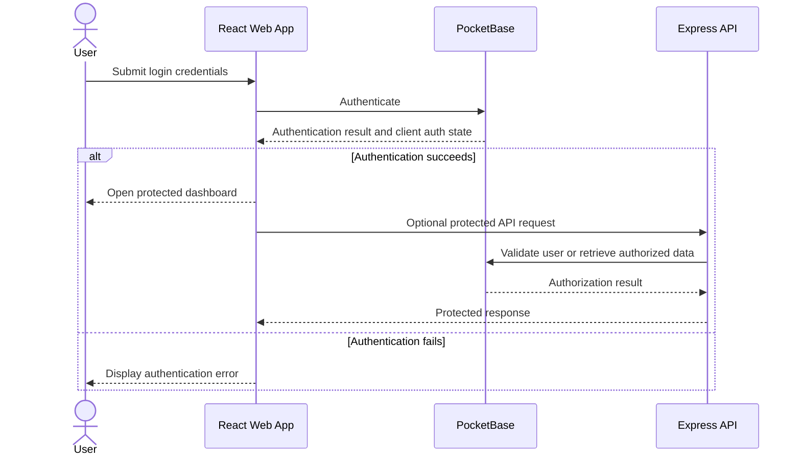

### 11.3 Authorization Principle

Frontend route protection improves user experience but is not sufficient security.

Authorization must be enforced through:

- PocketBase collection rules
- API authentication checks
- API authorization logic
- Role or ownership checks where required

### 11.4 Administrator Provisioning

Initial administrator credentials are read from environment variables rather than being permanently hardcoded in tracked source.

Relevant variables include:

- `PB_ADMIN_EMAIL`
- `PB_ADMIN_PASSWORD`

These values must not be committed.

### 11.5 Planned Evolution

Future authorization may include:

- Multiple users
- Organization membership
- Roles
- Permissions
- Resource ownership
- Audit trails
- More granular administrative boundaries

These capabilities should not be claimed as implemented until they are verified in code and tested.

---

## 12. Request Lifecycle

A typical API-backed request follows this sequence:

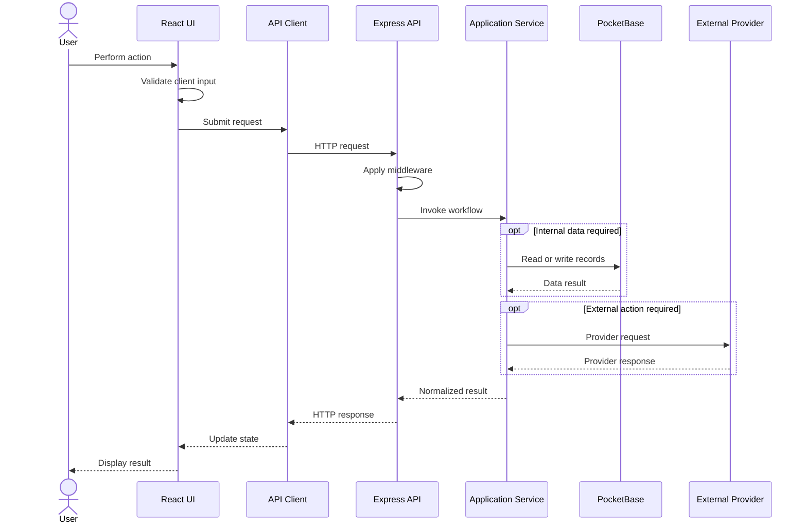

### 12.1 Validation Layers

Validation may occur at several layers:

- Browser form validation
- Route-level request validation
- Service-level business validation
- PocketBase schema validation
- Provider validation

Client-side validation improves usability.

Server-side and persistence-layer validation protect integrity.

---

## 13. Data Flow

### 13.1 Primary Data Flow

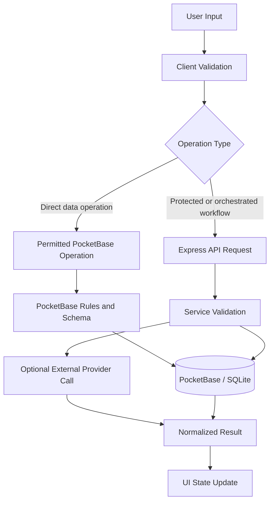

### 13.2 Direct PocketBase Access

Direct browser-to-PocketBase access can be appropriate when:

- Collection rules are sufficient
- No provider secret is required
- No privileged orchestration is required
- The operation is safe for the current user
- The data model supports the action cleanly

### 13.3 API-Mediated Access

The Express API should mediate actions when:

- Secrets are required
- External providers are involved
- Multiple operations must be coordinated
- Business rules exceed collection rules
- Provider responses must be normalized
- The action requires privileged server-side authority

---

## 14. Content and Publishing Architecture

Personal Dashboard includes content and publishing-oriented modules.

These may include:

- Blog content
- Content planning
- Campaigns
- Newsletters
- Social content
- Publishing queues
- Publishing activity
- Repurposing workflows
- Platform-specific content fields

### 14.1 Publishing Workflow

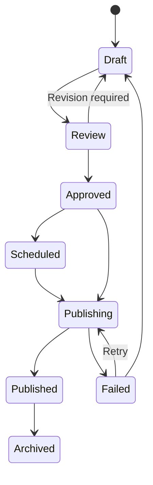

This diagram represents the intended workflow model. Exact statuses must remain aligned with the implemented collections and interfaces.

### 14.2 Publishing Responsibility

The frontend should:

- Collect content
- Display validation
- Show status
- Allow supported user actions

The API should:

- Validate publishing requests
- Load secure credentials
- Transform content for providers
- Call provider APIs
- Normalize provider responses
- Record results

PocketBase should:

- Store content
- Store publishing state
- Store provider identifiers when appropriate
- Store timestamps
- Store failure information appropriate for later diagnosis

### 14.3 Idempotency

Publishing operations should eventually support idempotency controls.

Without idempotency, retries may create duplicate posts.

A future implementation may use:

- Internal publishing attempt IDs
- Provider request identifiers
- Unique constraints
- State transitions
- Retry locks

---

## 15. AI Integration Architecture

The repository contains AI-assisted workspace concepts and provider-selection infrastructure.

### 15.1 Architectural Principle

The frontend should not contain privileged AI provider credentials.

AI requests requiring secrets should pass through the Express API.

### 15.2 Intended AI Flow

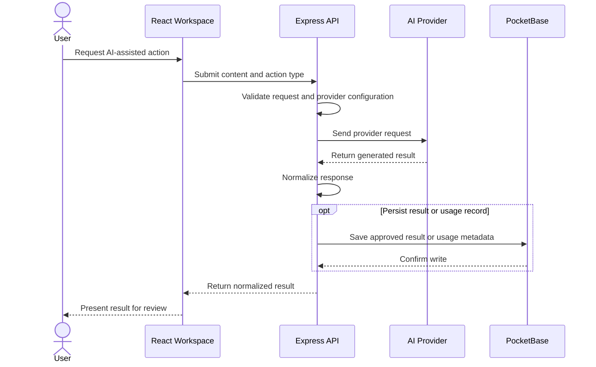

### 15.3 Human Review

AI-generated output should be treated as a draft unless a workflow explicitly establishes another rule.

The user should retain control over:

- Approval
- Editing
- Publishing
- Deletion
- Provider selection
- Sensitive data submission

### 15.4 Planned Controls

Future AI architecture may include:

- Provider abstraction
- Model selection
- Token or cost tracking
- Usage history
- Prompt templates
- Retry handling
- Content safety checks
- Redaction
- Audit metadata
- Approval gates

---

## 16. External Platform Integrations

The repository includes or anticipates infrastructure for external platforms such as:

- LinkedIn
- Facebook
- Instagram
- X / Twitter
- TikTok
- YouTube
- AI providers

### 16.1 Integration Boundary

External platforms are untrusted network dependencies.

The application must assume:

- APIs change
- Tokens expire
- Permissions vary
- Rate limits apply
- Responses may be incomplete
- Requests may fail
- Approval requirements may block functionality
- Sandbox and production behavior may differ

### 16.2 OAuth Flow

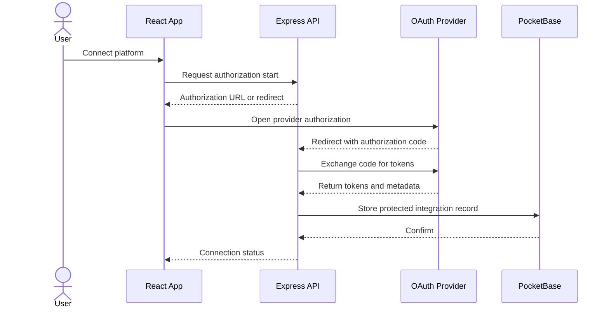

### 16.3 Token Storage

Token storage requires careful design.

At minimum:

- Tokens must never be committed
- Tokens must not be returned unnecessarily to the browser
- Sensitive token fields should be access-restricted
- Encryption should be used where supported
- Refresh and revocation must be handled
- Logs must not expose secrets

### 16.4 Integration Adapters

Provider-specific behavior should be isolated behind adapters or services.

This reduces the spread of provider-specific logic through route handlers and UI components.

---

## 17. Configuration Management

### 17.1 Configuration Sources

Configuration should come from:

- Tracked defaults that are safe
- `.env.example` files
- Local untracked `.env` files
- Production environment variables
- Version files such as `.nvmrc`
- Version files such as `.pocketbase-version`

### 17.2 Essential Variables

Known essential variables include:

| Variable | Responsibility |
| --- | --- |
| `PB_ADMIN_EMAIL` | Initial PocketBase administrator email |
| `PB_ADMIN_PASSWORD` | Initial PocketBase administrator password |
| `PB_ENCRYPTION_KEY` | Application encryption key |
| `PORT` | Express API port |
| `CORS_ORIGIN` | Trusted frontend origin |

Additional provider variables may include:

- OAuth client IDs
- OAuth client secrets
- Redirect URIs
- AI provider keys
- Provider-specific scopes
- Publishing configuration

### 17.3 Configuration Rule

Configuration should be injected into an application.

It should not be silently embedded in business logic.

### 17.4 Environment Separation

Future environments should be treated separately:

- Local development
- Test
- Staging
- Production

Each environment should have independent:

- Secrets
- Data
- URLs
- OAuth redirect URIs
- Backup policy
- Logging policy

---

## 18. Security Boundaries

### 18.1 Trust Boundaries

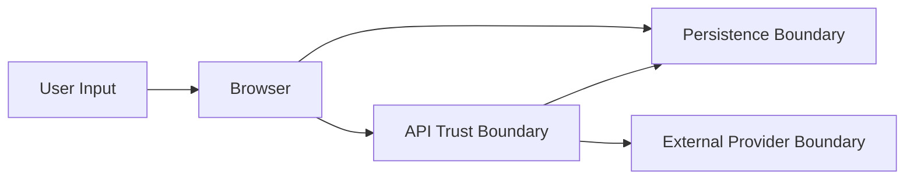

Every boundary requires validation.

### 18.2 Browser Boundary

The browser is not a trusted execution environment.

Do not place:

- OAuth client secrets
- AI provider secrets
- Administrator passwords
- Encryption master keys
- Privileged service credentials

inside frontend code or publicly exposed build variables.

### 18.3 API Boundary

The API must validate:

- Authentication
- Authorization
- Input shape
- Business rules
- Provider configuration
- Error exposure

### 18.4 Persistence Boundary

PocketBase rules and schema validation should prevent unauthorized access and malformed writes.

### 18.5 External Provider Boundary

Provider input and output must be treated as untrusted.

The application should validate:

- Response shape
- Status codes
- Identifiers
- URLs
- Token metadata
- Error payloads

### 18.6 Current Security Controls

The repository currently includes or documents:

- Environment-based configuration
- Environment-based administrator provisioning
- Ignored local secret files
- Ignored PocketBase runtime data
- Versioned schema migrations
- Helmet
- CORS middleware
- Rate limiting
- Request logging
- API error handling

### 18.7 Planned Security Controls

Planned controls include:

- Automated dependency scanning
- Secret scanning
- CI security checks
- Production-grade CORS restrictions
- HTTPS
- Backup encryption
- Token rotation procedures
- Vulnerability reporting process
- Audit logging
- Security-focused testing

---

## 19. Error Handling and Operational Visibility

### 19.1 Error Handling Goals

Errors should be:

- Detectable
- Structured
- Useful to developers
- Safe for users
- Free of secrets
- Traceable to a workflow

### 19.2 Error Categories

Recommended categories include:

- Validation error
- Authentication error
- Authorization error
- Not found
- Conflict
- Provider error
- Rate-limit error
- Persistence error
- Internal error

### 19.3 Logging

The API currently includes Morgan for request logging.

Future logging should support:

- Request identifiers
- Structured events
- Severity levels
- Provider operation context
- Publishing attempt IDs
- Redaction
- Production log retention

### 19.4 User-Facing Errors

The UI should show:

- What failed
- Whether the user can retry
- Whether data was saved
- Whether a provider action may have partially completed
- Where to look for more detail

The UI should not show:

- Stack traces
- Secrets
- Raw provider tokens
- Internal paths
- Sensitive request bodies

---

## 20. Local Development Architecture

The root workspace coordinates the three applications.

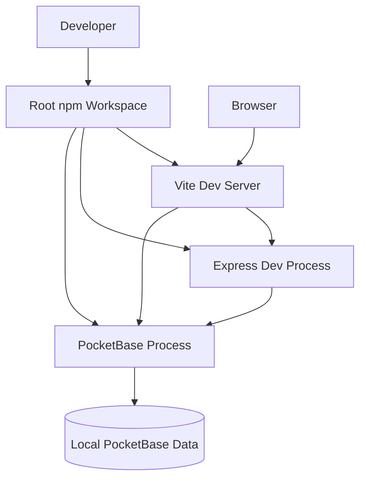

### 20.1 Current Development Ports

Known current defaults include:

| Service | Default |
| --- | --- |
| Web | `3000` |
| API | `3001` through the environment template |
| PocketBase | Commonly `8090`; confirm from process output |

### 20.2 Root Commands

The repository currently supports root-level workflows including:

```bash
npm install
npm run dev
npm run lint
npm run build
npm run start
```

### 20.3 Local Runtime Data

Local PocketBase runtime data should remain outside Git.

Developers should reproduce schema through migrations, not by sharing a live SQLite file through the repository.

---

## 21. Deployment Architecture

### 21.1 Current State

The verified architecture is currently a local-development architecture.

The repository should not claim that the application is production-deployed unless the deployment has been completed and validated.

### 21.2 Planned Self-Hosted Deployment

A future VPS deployment may use:

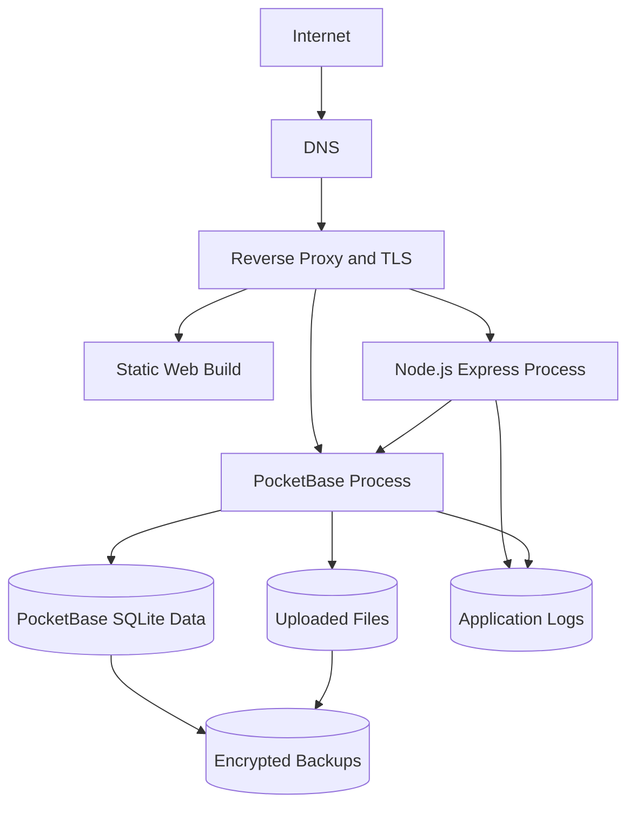

### 21.3 Planned Deployment Responsibilities

A production deployment should define:

- Domain and DNS
- TLS certificates
- Reverse proxy
- Process supervision
- Environment variables
- Persistent storage
- File permissions
- Backups
- Restore testing
- Monitoring
- Log retention
- Update procedure
- Rollback procedure
- Firewall rules

### 21.4 Deployment Separation

Even if all services begin on one VPS, they should retain logical separation:

- Web build
- API process
- PocketBase process
- Persistent data
- Backup storage

This preserves a path to future scaling.

---

## 22. Scalability Considerations

Personal Dashboard does not currently need hyperscale architecture.

The architecture should optimize first for:

- Correctness
- Maintainability
- Security
- Reproducibility
- Clear ownership
- Reasonable operational cost

### 22.1 PocketBase and SQLite

PocketBase and SQLite are appropriate for the current stage because they provide:

- Low operational complexity
- Fast local setup
- Integrated authentication
- Integrated file support
- Migrations
- Simple self-hosting

Potential future pressure points include:

- High write concurrency
- Large multi-tenant workloads
- Horizontal scaling
- Complex analytics
- Large background job volumes

A database migration should only be considered when verified requirements justify it.

### 22.2 API Scaling

Future API scaling options include:

- Process supervision
- Multiple API instances
- Background workers
- Queues
- Provider-specific retry workers
- Caching
- Read replicas after a future database transition

### 22.3 Frontend Scaling

The frontend can evolve through:

- Route-level code splitting
- Lazy loading
- Asset optimization
- CDN delivery
- Static hosting
- Improved API caching

### 22.4 Integration Scaling

Publishing workflows may eventually require:

- Queue-based processing
- Scheduled jobs
- Retry policies
- Dead-letter handling
- Idempotency keys
- Provider-specific rate-limit controls

---

## 23. Architectural Decisions

This section records current design decisions in a lightweight format.

Detailed decisions may later be moved into formal Architecture Decision Records.

### ADR-001: Use a Monorepo

**Status:** Accepted

**Decision:** Keep web, API, and PocketBase workspaces in one repository.

**Rationale:**

- Coordinated development
- Shared history
- Easier local setup
- Clear portfolio presentation
- Easier cross-layer changes

**Tradeoff:**

- Requires discipline to preserve boundaries

---

### ADR-002: Use React and Vite for the Web Application

**Status:** Accepted

**Decision:** Use React for the UI and Vite for development and builds.

**Rationale:**

- Fast local development
- Strong ecosystem
- Component model
- Appropriate for the current dashboard architecture

**Tradeoff:**

- Browser-side complexity must be managed carefully

---

### ADR-003: Use Express for Server-Side Workflows

**Status:** Accepted

**Decision:** Use Express as the server-side API layer.

**Rationale:**

- Clear routing model
- Large ecosystem
- Appropriate for integrations and orchestration
- Consistent JavaScript runtime across the project

**Tradeoff:**

- Structure and conventions must be enforced by the project

---

### ADR-004: Use PocketBase as the Current Backend Platform

**Status:** Accepted

**Decision:** Use PocketBase for authentication, collections, SQLite persistence, migrations, hooks, and local files.

**Rationale:**

- Low operational burden
- Fast iteration
- Integrated authentication
- Self-hosting
- Strong fit for the current project stage

**Tradeoff:**

- Future scale or tenancy requirements may eventually require architectural changes

---

### ADR-005: Keep Secrets Out of Git

**Status:** Accepted

**Decision:** Use environment variables and untracked local environment files.

**Rationale:**

- Protect credentials
- Support multiple environments
- Improve repository safety

**Tradeoff:**

- Requires documentation and configuration discipline

---

### ADR-006: Version Database Schema Through Migrations

**Status:** Accepted

**Decision:** Commit migrations and exclude runtime database files.

**Rationale:**

- Reproducible schema
- Reviewable history
- Safer collaboration
- Cleaner repository

**Tradeoff:**

- Migration quality becomes critical

---

### ADR-007: Separate Direct Data Access From Orchestrated Workflows

**Status:** Accepted

**Decision:** Permit direct PocketBase access where rules are sufficient and use the Express API where privileged logic or external coordination is required.

**Rationale:**

- Avoid unnecessary API duplication
- Preserve a secure boundary for secrets
- Keep complex workflows server-side

**Tradeoff:**

- Requires clear documentation of which path each feature uses

---

### ADR-008: Distinguish Current From Planned Architecture

**Status:** Accepted

**Decision:** Label unimplemented or unverified architecture as planned.

**Rationale:**

- Honest portfolio representation
- Better engineering communication
- Reduced maintenance confusion

**Tradeoff:**

- Documentation requires ongoing review

---

## 24. Known Limitations

The current architecture has known limitations.

### 24.1 Production Readiness

The system is not yet documented as production-ready.

Pending work includes:

- Automated testing
- Continuous integration
- Deployment automation
- Production monitoring
- Backup validation
- Security scanning
- Recovery testing

### 24.2 External Integrations

Integration code or interfaces do not guarantee live production access.

Providers may require:

- Developer application approval
- Verified domains
- Approved redirect URIs
- Additional permissions
- Platform review
- Paid access
- Production credentials

### 24.3 Background Processing

The current architecture does not yet establish a durable background queue system.

This matters for:

- Scheduled publishing
- Retries
- Long-running AI jobs
- Rate-limited provider operations
- Batch operations

### 24.4 Multi-Tenancy

The project should not be treated as a mature multi-tenant SaaS platform.

Future multi-user development will require explicit work on:

- Isolation
- Roles
- Permissions
- Ownership
- Quotas
- Billing
- Auditing

### 24.5 Operational Resilience

Formal recovery, failover, and restore procedures remain planned.

---

## 25. Future Evolution

Future architecture may evolve through the following stages.

### Phase 1: Documentation and Baseline Validation

- Complete architecture documentation
- Complete environment documentation
- Complete contribution guidelines
- Complete security policy
- Add validation scripts
- Confirm current collection and route boundaries

### Phase 2: Automated Quality Controls

- Unit tests
- Integration tests
- Route tests
- Migration tests
- Frontend component tests
- GitHub Actions
- Dependency scanning
- Secret scanning

### Phase 3: Containerized Local and Production Environments

- Dockerfiles
- Docker Compose
- Persistent volumes
- Environment templates
- Health checks
- Reproducible service startup

### Phase 4: VPS Deployment

- Reverse proxy
- HTTPS
- Process supervision
- Production environment variables
- Backup automation
- Monitoring
- Restore testing

### Phase 5: Durable Workflow Processing

- Job queue
- Scheduled workers
- Retry policy
- Idempotent publishing
- Provider rate-limit controls
- Failure recovery

### Phase 6: Multi-User Architecture

- User ownership
- Organizations
- Roles
- Permissions
- Resource isolation
- Audit trails

### Phase 7: Platform Expansion

- Modular integrations
- Plugin boundaries
- API versioning
- Public API
- Webhooks
- Additional storage or database architecture when justified

---

## 26. Change Management

### 26.1 When This Document Must Be Updated

Update `ARCHITECTURE.md` when a change introduces or materially changes:

- A workspace
- A service boundary
- An authentication flow
- An authorization model
- A database responsibility
- A deployment topology
- An external provider
- A background processing system
- A security boundary
- A major architectural decision

### 26.2 Pull Request Expectations

Architecture-changing pull requests should explain:

- What changed
- Why it changed
- Which components are affected
- Which data flows are affected
- Which security boundaries are affected
- Whether migrations are required
- Whether deployment changes are required
- Whether this document was updated

### 26.3 Architecture Decision Records

Formal ADRs may later be stored under:

```text
docs/architecture/decisions/
```

Suggested naming:

```text
0001-use-pocketbase.md
0002-introduce-job-queue.md
0003-production-deployment-topology.md
```

---

## 27. Related Documentation

- [README.md](README.md) — Project overview and quick start
- [CONTRIBUTING.md](CONTRIBUTING.md) — Development workflow and contribution standards
- [SECURITY.md](SECURITY.md) — Security policy and vulnerability reporting
- [ROADMAP.md](ROADMAP.md) — Full development roadmap
- [ENGINEERING_PRINCIPLES.md](ENGINEERING_PRINCIPLES.md) — Project engineering philosophy
- [docs/DEVELOPMENT.md](docs/DEVELOPMENT.md) — Local development guide
- [docs/ENVIRONMENT.md](docs/ENVIRONMENT.md) — Environment variable reference
- [docs/DEPLOYMENT.md](docs/DEPLOYMENT.md) — Deployment guide

---

## Architecture Summary

Personal Dashboard currently uses a pragmatic three-workspace architecture:

- React and Vite for presentation
- Express for server-side orchestration
- PocketBase for authentication and persistence

The architecture is intentionally simple enough to operate during active development while preserving a path toward:

- Secure self-hosting
- Automated testing
- Containerization
- Durable publishing workflows
- Additional integrations
- Multi-user capabilities
- Larger product evolution

The central architectural principle is:

> Keep each responsibility in the smallest trustworthy boundary that can own it well.
