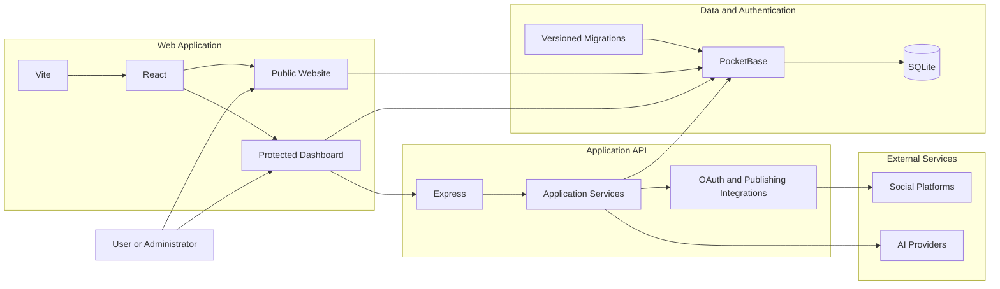

# Personal Dashboard

A self-hosted personal operating system for creators, founders, and professionals.

Built with React, Express, and PocketBase.

[](ROADMAP.md)
[](https://github.com/rohamcarrion-cloud/personal-dashboard)
[](LICENSE)
[](.nvmrc)
[](apps/pocketbase/.pocketbase-version)
[](ROADMAP.md)

> **Project status:** Active development. The secure local engineering baseline is established, while testing, continuous integration, containerization, and production deployment remain planned.

---

## Table of Contents

- [Overview](#overview)
- [Project Vision](#project-vision)
- [Why This Project Exists](#why-this-project-exists)
- [Current Status](#current-status)
- [Current Features](#current-features)
- [Architecture](#architecture)
- [Technology Stack](#technology-stack)
- [Repository Structure](#repository-structure)
- [Quick Start](#quick-start)
- [Essential Environment Variables](#essential-environment-variables)
- [Available Commands](#available-commands)
- [Documentation](#documentation)
- [Roadmap](#roadmap)
- [Security](#security)
- [License](#license)
- [About the Developer](#about-the-developer)

---

## Overview

Personal Dashboard is a self-hosted platform designed to centralize content management, project planning, publishing workflows, analytics, AI-assisted content generation, and business operations within a single application.

The project combines a public-facing website with a protected administrative dashboard. Its purpose is to reduce the fragmentation created by managing content, projects, campaigns, contacts, events, media, newsletters, and publishing activity across many disconnected services.

This repository also documents the transformation of an application prototype into a locally maintained and professionally organized software project. That process includes source control, reproducible setup, environment-based configuration, secure secret handling, database migrations, documentation, testing, and deployment planning.

Personal Dashboard is not presented as a finished commercial product. It is an active engineering project that will continue to evolve through deliberate, reviewable development phases.

---

## Project Vision

The long-term vision is to develop Personal Dashboard into a modular personal operating system for creators, founders, professionals, and small organizations.

The platform is intended to provide one owned environment for coordinating:

- Content strategy and editorial planning
- Blog and newsletter publishing
- Social media content and distribution
- Campaign planning and performance monitoring
- Project, task, calendar, and event management
- Contact and opportunity tracking
- Media, press, and brand asset management
- Analytics and operational visibility
- AI-assisted content and workflow support
- Self-hosted data and infrastructure

The objective is not simply to display information in a dashboard. The objective is to create a practical digital command center that can grow alongside the person or organization operating it.

---

## Why This Project Exists

Creators, founders, and professionals often rely on a collection of unrelated platforms to manage their work. A single workflow may require separate products for blogging, social publishing, email newsletters, customer relationship management, project management, analytics, file storage, AI assistance, and campaign planning.

Every additional service introduces another:

- Subscription
- Account
- Data boundary
- Integration dependency
- Interface to learn
- Vendor relationship
- Operational failure point

Personal Dashboard explores a different approach:

> Build and own the operational platform instead of permanently renting the workflow.

The project is also a hands-on software engineering learning environment. It provides a real codebase through which to practice application architecture, frontend and backend development, databases, authentication, APIs, security, Git, GitHub, infrastructure, and professional engineering processes.

---

## Current Status

The first secure engineering baseline has been established and published to GitHub.

The current repository includes:

- An npm workspaces monorepo
- A React and Vite frontend
- A Node.js and Express API
- A PocketBase backend
- PocketBase migrations and hooks
- Environment-based configuration
- Environment-based administrator provisioning
- Public and protected application routes
- Content, campaign, project, event, media, and publishing modules
- AI-assisted workspace components
- Social integration infrastructure
- Root development, lint, build, and start commands
- A secure `.gitignore`
- A public Git history beginning with an engineering baseline commit

The application currently runs as a local development environment. Production-readiness work—including automated tests, continuous integration, containers, deployment, monitoring, and backup validation—is tracked in the roadmap.

---

## Current Features

The items below describe implemented application areas and repository capabilities. They are listed as features rather than roadmap tasks because they represent the current project surface.

### Content and Publishing

- Blog content management
- Content planning and production workflows
- Master content records
- Campaign management
- Newsletter campaign management
- Social media content management
- Multi-platform caption fields
- Publishing queue interfaces
- Publishing activity monitoring
- Publishing metrics and status records
- Repurposing recommendations
- Scheduling-related workflow support

### Business Operations

- Project management
- Task management
- Calendar planning
- Event management
- Contact and opportunity records
- Growth opportunity tracking
- Activity logging
- Media library
- Press and media management
- Press asset management
- Brand kit and public branding settings

### Platform Capabilities

- PocketBase authentication
- Protected dashboard routes
- Public website routes
- Environment-based configuration
- Environment-based administrator provisioning
- Express API middleware
- API error handling
- Rate limiting
- Security header middleware
- Analytics dashboards and charts
- Workflow and data health interfaces
- AI-assisted content workspace
- AI provider selection interfaces
- AI usage history records
- OAuth integration infrastructure
- Social account records
- Credential-management utilities
- PocketBase migrations
- PocketBase hooks

### External Platform Infrastructure

The repository contains integration or publishing infrastructure for:

- LinkedIn
- Facebook
- Instagram
- X / Twitter
- TikTok
- YouTube

Live integrations require valid developer applications, credentials, redirect URIs, platform approval where applicable, and additional production validation. Their presence in the repository should not be interpreted as a guarantee that every platform workflow is production-ready.

---

## Architecture

Personal Dashboard uses a monorepo containing three primary applications:

1. **Web** — React and Vite application for the public website and protected dashboard
2. **API** — Node.js and Express service for application logic, integrations, publishing, and supporting operations
3. **PocketBase** — Authentication, collections, SQLite persistence, migrations, hooks, and local file storage

The frontend can communicate with both the Express API and PocketBase, while the API coordinates server-side workflows and external integrations.



This diagram is intentionally simplified. Detailed component responsibilities, data flows, request sequences, integration boundaries, architectural decisions, and tradeoffs belong in [ARCHITECTURE.md](ARCHITECTURE.md).

---

## Technology Stack

### Frontend

- React 18
- Vite 7
- React Router
- React Hook Form
- Zod
- Tailwind CSS
- Radix UI primitives
- Recharts
- Framer Motion
- Lucide React
- Sonner
- PocketBase JavaScript SDK

### Backend

- Node.js 22
- Express 5
- Axios
- CORS middleware
- Helmet
- Morgan
- Express Rate Limit
- PocketBase JavaScript SDK

### Data and Authentication

- PocketBase 0.38.0
- SQLite
- PocketBase authentication
- PocketBase collections
- Versioned PocketBase migrations
- PocketBase JavaScript hooks

### Tooling

- npm
- npm workspaces
- Concurrently
- ESLint
- Git
- GitHub
- Markdown
- Mermaid

### Planned Engineering Infrastructure

- Automated tests
- GitHub Actions
- Dependency and security scanning
- Docker and Docker Compose
- CI/CD
- VPS deployment
- NGINX or another reverse proxy
- HTTPS
- Automated backups
- Production monitoring

---

## Repository Structure

```text
personal-dashboard/
├── apps/
│   ├── api/
│   │   ├── migrations/
│   │   ├── src/
│   │   │   ├── constants/
│   │   │   ├── middleware/
│   │   │   ├── routes/
│   │   │   ├── services/
│   │   │   └── utils/
│   │   ├── .env.example
│   │   └── package.json
│   │
│   ├── pocketbase/
│   │   ├── pb_hooks/
│   │   ├── pb_migrations/
│   │   ├── database-types.d.ts
│   │   ├── .pocketbase-version
│   │   └── package.json
│   │
│   └── web/
│       ├── plugins/
│       ├── public/
│       ├── src/
│       │   ├── components/
│       │   ├── contexts/
│       │   ├── docs/
│       │   ├── hooks/
│       │   ├── lib/
│       │   ├── pages/
│       │   └── utils/
│       ├── tools/
│       ├── vite.config.js
│       └── package.json
│
├── docs/
│   ├── images/
│   ├── DEVELOPMENT.md
│   ├── DEPLOYMENT.md
│   └── ENVIRONMENT.md
│
├── .gitignore
├── .nvmrc
├── .version
├── ARCHITECTURE.md
├── CONTRIBUTING.md
├── ENGINEERING_PRINCIPLES.md
├── LICENSE
├── ROADMAP.md
├── SECURITY.md
├── package-lock.json
├── package.json
└── README.md
```

> Some documentation paths shown above are part of the planned documentation structure and may be added in later documentation commits.

### Workspace Responsibilities

| Workspace | Responsibility |
| --- | --- |
| `apps/web` | Public website, protected dashboard, user interface, forms, navigation, charts, and browser-side application state |
| `apps/api` | Express routes, middleware, server-side workflows, publishing services, OAuth support, analytics, and integrations |
| `apps/pocketbase` | Authentication, collections, SQLite data, migrations, hooks, and local file storage |

---

## Quick Start

### Prerequisites

Install the following before running the project:

- Git
- Node.js 22
- npm
- A PocketBase 0.38.0 executable compatible with your operating system and processor architecture

The project includes an `.nvmrc` file for Node.js 22.

### 1. Clone the Repository

Using SSH:

```bash
git clone git@github.com:rohamcarrion-cloud/personal-dashboard.git
```

Or using HTTPS:

```bash
git clone https://github.com/rohamcarrion-cloud/personal-dashboard.git
```

Enter the repository:

```bash
cd personal-dashboard
```

### 2. Select the Node.js Version

When using `nvm`:

```bash
nvm install
nvm use
```

### 3. Install Dependencies

From the repository root:

```bash
npm install
```

### 4. Configure the API Environment

Copy the API environment template:

```bash
cp apps/api/.env.example apps/api/.env
```

Replace placeholder values with local development configuration. Never commit the resulting `.env` file.

PocketBase environment variables must also be available to the PocketBase process. Refer to [docs/ENVIRONMENT.md](docs/ENVIRONMENT.md) when that guide is added.

### 5. Install the PocketBase Executable

Download PocketBase 0.38.0 for your operating system and processor architecture.

Place the executable here:

```text
apps/pocketbase/pocketbase
```

On macOS or Linux, make it executable:

```bash
chmod +x apps/pocketbase/pocketbase
```

Verify it:

```bash
apps/pocketbase/pocketbase --version
```

### 6. Start the Development Environment

From the repository root:

```bash
npm run dev
```

The root development command starts the web, API, and PocketBase workspaces concurrently.

The current frontend is configured to use port `3000`. The API template uses port `3001`. PocketBase commonly uses port `8090`; confirm all active addresses from the terminal output.

For complete installation, troubleshooting, and workspace-specific instructions, see [docs/DEVELOPMENT.md](docs/DEVELOPMENT.md) when available.

---

## Essential Environment Variables

The README lists only the most important environment variable groups. The complete reference belongs in [docs/ENVIRONMENT.md](docs/ENVIRONMENT.md).

| Variable | Purpose |
| --- | --- |
| `PB_ADMIN_EMAIL` | Email used by the PocketBase migration that provisions the initial administrator |
| `PB_ADMIN_PASSWORD` | Password used to provision the initial administrator |
| `PB_ENCRYPTION_KEY` | Base64-formatted key used for application encryption |
| `PORT` | Express API port |
| `CORS_ORIGIN` | Trusted frontend origin allowed to communicate with the API |

The API environment template also includes credential and redirect URI placeholders for supported social platforms.

Generate a local Base64 key with:

```bash
openssl rand -base64 32
```

Never commit:

- Real administrator credentials
- OAuth client secrets
- AI provider keys
- Production encryption keys
- Local `.env` files
- PocketBase runtime data

---

## Available Commands

Run these commands from the repository root.

### Start Development

```bash
npm run dev
```

Starts the web, API, and PocketBase workspaces concurrently.

### Run Linting

```bash
npm run lint
```

Runs ESLint for the web and API workspaces.

### Create a Production Build

```bash
npm run build
```

Runs the frontend build process.

### Start Backend Services

```bash
npm run start
```

Starts the API and PocketBase processes using their configured start scripts.

### Run Workspaces Individually

Web:

```bash
npm run dev --prefix apps/web
```

API:

```bash
npm run dev --prefix apps/api
```

PocketBase:

```bash
npm run dev --prefix apps/pocketbase
```

Before creating a commit or pull request, the minimum local validation target is:

```bash
npm run lint
npm run build
```

Detailed development workflow, branch naming, commit conventions, pull request expectations, and validation requirements belong in [CONTRIBUTING.md](CONTRIBUTING.md).

---

## Documentation

The README is the repository’s front door. Detailed material is intentionally separated into focused documents so this page remains informative and easy to scan.

| Document | Purpose |
| --- | --- |
| [ARCHITECTURE.md](ARCHITECTURE.md) | System design, component boundaries, data flow, request sequences, integrations, decisions, and tradeoffs |
| [CONTRIBUTING.md](CONTRIBUTING.md) | Branch workflow, commit conventions, pull requests, validation, reviews, bug reports, and feature proposals |
| [SECURITY.md](SECURITY.md) | Secrets policy, vulnerability reporting, credential rotation, security limitations, and production security plans |
| [ROADMAP.md](ROADMAP.md) | Full phase-by-phase development plan |
| [ENGINEERING_PRINCIPLES.md](ENGINEERING_PRINCIPLES.md) | Ownership, reproducibility, secure defaults, focused commits, honest documentation, and learning in public |
| [docs/DEVELOPMENT.md](docs/DEVELOPMENT.md) | Complete local setup, workspace commands, PocketBase installation, validation, and troubleshooting |
| [docs/ENVIRONMENT.md](docs/ENVIRONMENT.md) | Required and optional variables, encryption format, OAuth configuration, AI providers, and production guidance |
| [docs/DEPLOYMENT.md](docs/DEPLOYMENT.md) | Planned production infrastructure, deployment process, reverse proxy, HTTPS, monitoring, and recovery |

These files are being added through focused documentation commits. A link may temporarily point to a planned document until that document is committed.

---

## Roadmap

- [x] Establish a secure local engineering baseline
- [x] Repair and verify the PocketBase development environment
- [x] Move administrator credentials to environment variables
- [x] Verify linting and the production build
- [x] Initialize Git and create the baseline commit
- [x] Publish the repository to GitHub
- [ ] Complete the repository documentation set
- [ ] Add automated testing
- [ ] Add GitHub Actions
- [ ] Add dependency and security scanning
- [ ] Add Docker support
- [ ] Complete production configuration
- [ ] Deploy to a VPS
- [ ] Add monitoring, backups, and recovery procedures
- [ ] Expand multi-user and role-based access capabilities

See [ROADMAP.md](ROADMAP.md) for the complete phase-by-phase roadmap.

---

## Security

The repository follows several secure-development practices:

- Local `.env` files are excluded from Git
- Example environment templates may be committed without real credentials
- PocketBase runtime data, backups, and snapshots are excluded
- The platform-specific PocketBase executable is excluded
- Private local files under `vault/` are excluded
- Initial administrator credentials are read from environment variables
- OAuth credentials are represented through environment configuration
- Database schema changes are stored as versioned migrations
- The API includes error-handling, rate-limiting, and security-header middleware

Security remains an ongoing workstream. Automated scanning, production secret management, restrictive CORS, HTTPS, backup validation, token review, and formal vulnerability reporting are planned.

Do not publish sensitive vulnerability details in a public issue. See [SECURITY.md](SECURITY.md) for the complete policy once that document is added.

---

## License

Copyright © 2026 Roham Carrion. All Rights Reserved.

This repository is publicly visible for educational, portfolio, review, and demonstration purposes. Public visibility does not place the source code in the public domain and does not grant an open-source license.

Unless separate written permission is provided, commercial use, redistribution, resale, relicensing, and the operation of a competing product using this source code are prohibited.

The complete notice belongs in the repository’s [LICENSE](LICENSE.md) file.

---

## About the Developer

Personal Dashboard is built by **Roham Carrion** as part of a hands-on software engineering journey focused on creating production-quality applications while documenting the learning process publicly.

The project represents a transition from depending primarily on hosted application builders and disconnected software services toward directly understanding and owning:

- Source code
- Application architecture
- Frontend and backend development
- Databases and migrations
- Authentication and authorization
- APIs and external integrations
- Security and secret management
- Git and GitHub workflows
- Infrastructure and deployment
- Product development processes

The long-term goal is to apply the lessons learned through this repository to larger creator platforms, business operating systems, AI-assisted products, self-hosted services, and future research and development initiatives.

---

## Project Philosophy

> Build what you want to own.  
> Understand what you depend on.  
> Document what you learn.  
> Improve one commit at a time.

---

## Repository

**GitHub:** [rohamcarrion-cloud/personal-dashboard](https://github.com/rohamcarrion-cloud/personal-dashboard)

```bash
git clone git@github.com:rohamcarrion-cloud/personal-dashboard.git
```
